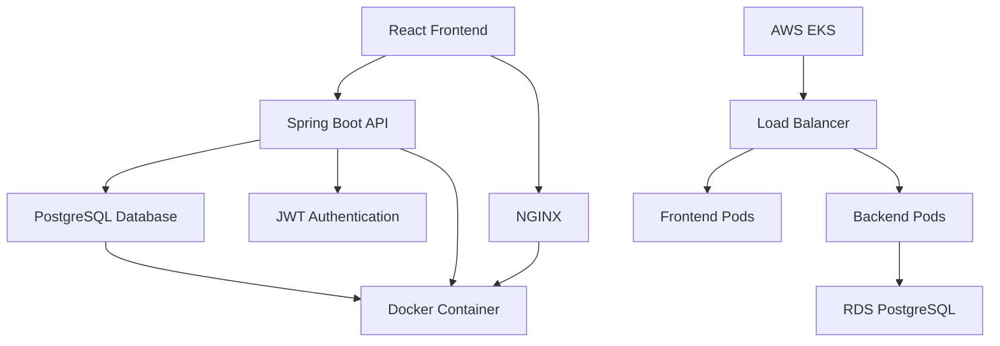

# ✓ TodoApp - Modern Task Management

A sleek, modern TODO web application built with **React**, **Spring Boot**, and **PostgreSQL**. Designed for productivity with a beautiful UI, real-time synchronization, and enterprise-grade scalability.


## 🌟 Features

### ✨ Core Functionality
- **User Authentication** - Secure registration, login, and password management
- **Task Management** - Create, edit, delete, and organize tasks with priorities
- **Categories & Tags** - Flexible organization system with color-coded categories
- **Smart Filtering** - Advanced search and filtering by status, priority, due date, and tags
- **Dashboard Analytics** - Visual task statistics and productivity insights
- **Due Date Management** - Set deadlines with visual overdue indicators

### 🎨 Modern UI/UX
- **Responsive Design** - Seamless experience across desktop, tablet, and mobile
- **Dark/Light Theme** - Customizable appearance with system preference detection
- **Accessibility First** - Screen reader support, keyboard navigation, high contrast mode
- **Progressive Web App** - Offline functionality with service worker caching
- **Real-time Sync** - Multi-device synchronization with WebSocket updates

### 🚀 Advanced Features
- **Auto-save** - Automatic saving with debounced input
- **Bulk Operations** - Edit or delete multiple tasks simultaneously
- **Data Export/Import** - JSON and CSV format support
- **Email Notifications** - Configurable reminders for due dates
- **Achievement System** - Productivity streaks and completion celebrations

## 🏗️ Architecture



### Technology Stack
- **Frontend**: React 18+ with TypeScript, Redux Toolkit, Material-UI
- **Backend**: Spring Boot 3.1.5 with Java 21, Spring Security, Spring Data JPA
- **Database**: PostgreSQL 15+ with environment-specific Docker containers
- **Container**: Docker/Podman with separate development and production images
- **Deployment**: AWS EKS with auto-scaling and load balancing
- **Development**: Podman Desktop with hot-reload and sample data support

## 🚀 Quick Start

### Prerequisites
- **Podman Desktop** or Docker installed
- **Git** for version control
- **Node.js 18+** (for local frontend development)
- **Java 21+** (for local backend development)

### 1. Clone and Start
```bash
# Clone the repository
git clone https://github.com/your-username/todo-app.git
cd todo-app

# Start all services with Docker Compose (development setup)
docker-compose up --build

# Or with Podman Desktop (includes sample data for development)
podman compose up --build
```

### 2. Access the Application
- **Frontend**: http://localhost:3000
- **Backend API**: http://localhost:8080/api
- **API Documentation**: http://localhost:8080/swagger-ui.html
- **Database**: localhost:5432 (tododb/todouser/todopass)

### 3. Demo Account
- **Email**: demo@example.com
- **Password**: password
- **Pre-loaded**: Sample tasks and categories

## 💻 Development

### Local Development Setup
```bash
# Frontend development with hot reload
cd frontend
npm install
npm run dev  # Runs on http://localhost:5173

# Backend development with hot reload
cd backend
./gradlew bootRun

# Database only (development with sample data)
docker-compose up database
# Note: Uses Dockerfile with demo users and sample tasks
```

### Development Tools
- **Hot Reload**: Both React (Vite) and Spring Boot (DevTools)
- **Debug Support**: Java remote debugging on port 5005
- **Database GUI**: Connect with any PostgreSQL client (includes sample data)
- **API Testing**: Swagger UI available at http://localhost:8080/swagger-ui.html
- **Database Setup**: Separate development and production Docker configurations

### Project Structure
```
todo-app/
├── frontend/              # React TypeScript application
│   ├── src/components/   # Reusable UI components
│   ├── src/pages/        # Page components
│   ├── src/store/        # Redux store and slices
│   └── Dockerfile        # Frontend container build
├── backend/               # Spring Boot application
│   ├── src/main/java/    # Java source code
│   ├── src/test/         # Test classes
│   ├── Dockerfile        # Development container build
│   └── Dockerfile.prod   # Production container build
├── database/              # PostgreSQL setup with environment-specific configs
│   ├── db/init/          # Schema initialization scripts
│   ├── Dockerfile        # Development container (with sample data)
│   ├── Dockerfile.prod   # Production container (clean database)
│   ├── postgresql.prod.conf # Production-optimized PostgreSQL config
│   └── README.md         # Database setup guide
├── k8s/                   # Kubernetes manifests for EKS
├── docs/                  # Complete project documentation
└── docker-compose.yml    # Local development orchestration
```

## 📚 Documentation

### Complete Project Documentation
- **[Functional Requirements](docs/functional-requirements.md)** - Feature specifications and user stories
- **[Technical Architecture](docs/technical-architecture.md)** - System design, API specs, and deployment guide
- **[UI Mockups](docs/ui-mockups.md)** - Complete design system and visual mockups
- **[Database Setup Guide](database/README.md)** - Comprehensive database setup for development and production
- **[Backend Documentation](backend/README.md)** - Spring Boot application setup and API documentation

### API Documentation
- **Development**: http://localhost:8080/swagger-ui.html
- **Production**: https://your-app.com/swagger-ui.html

## 🧪 Testing

### Frontend Testing
```bash
cd frontend
npm run test          # Unit tests with Jest
npm run test:e2e      # End-to-end tests with Cypress
npm run lint          # ESLint and Prettier
```

### Backend Testing
```bash
cd backend
./gradlew test           # Unit and integration tests
./gradlew verify         # Full test suite with coverage
```

### Database Testing
- **Testcontainers** integration for isolated database testing
- **Development container** with sample data automatically loaded
- **Production container** testing with clean database schema
- **Environment isolation** with separate Docker configurations

## 🚀 Deployment

### Production Deployment (AWS EKS)
```bash
# Build production images (uses Dockerfile.prod for database)
./scripts/deploy-to-aws.sh

# Or deploy manually
aws eks update-kubeconfig --name todo-cluster
kubectl apply -f k8s/manifests/
```

### Environment Configuration
- **Development**: Local Docker/Podman setup with sample data
- **Staging**: AWS EKS with clean database (no sample data)
- **Production**: AWS EKS with RDS PostgreSQL or containerized production database

### Database Deployment Options
- **Development**: `Dockerfile` - includes sample data and demo users
- **Production**: `Dockerfile.prod` - clean database with optimized configuration
- **Staging/Production**: Can also use managed AWS RDS PostgreSQL

## 🤝 Contributing

### Development Workflow
1. **Fork** the repository
2. **Create** a feature branch (`git checkout -b feature/amazing-feature`)
3. **Commit** your changes (`git commit -m 'Add amazing feature'`)
4. **Push** to the branch (`git push origin feature/amazing-feature`)
5. **Open** a Pull Request

### Code Standards
- **Frontend**: ESLint + Prettier configuration
- **Backend**: Google Java Style Guide
- **Commits**: Conventional commit messages
- **Testing**: Minimum 80% code coverage

### Issues and Bugs
Please use the [GitHub Issues](https://github.com/your-username/todo-app/issues) page to report bugs or request features.

## 📈 Roadmap

### Phase 1: MVP (Weeks 1-4) ✅
- [x] Project setup and documentation
- [x] Basic authentication system
- [x] Core task CRUD operations
- [x] Responsive design foundation

### Phase 2: Enhanced Features (Weeks 5-8)
- [ ] Categories and tags implementation
- [ ] Advanced filtering and search
- [ ] Task priority and due dates
- [ ] User settings and preferences

### Phase 3: Advanced Features (Weeks 9-12)
- [ ] PWA with offline support
- [ ] Email notifications
- [ ] Real-time synchronization
- [ ] Data import/export

### Phase 4: Production Ready (Weeks 13-16)
- [ ] Comprehensive testing
- [ ] Security audit
- [ ] Performance optimization
- [ ] Production deployment

## 📊 Performance

### Benchmarks
- **Page Load**: < 3 seconds
- **Task Operations**: < 1 second
- **Search Results**: < 2 seconds
- **Mobile Performance**: 90+ Lighthouse score

### Scalability
- **Users**: Supports 10,000+ concurrent users
- **Tasks**: Up to 10,000 tasks per user
- **Availability**: 99.9% uptime SLA

## 🔒 Security

- **Authentication**: JWT with 30-minute sliding sessions
- **Authorization**: Role-based access control
- **Data Protection**: Encryption in transit and at rest
- **Compliance**: OWASP security guidelines
- **Privacy**: GDPR-compliant data handling

## 📱 Browser Support

| Browser | Version | Status |
|---------|---------|--------|
| Chrome  | 90+     | ✅ Full Support |
| Firefox | 88+     | ✅ Full Support |
| Safari  | 14+     | ✅ Full Support |
| Edge    | 90+     | ✅ Full Support |

## 📄 License

This project is licensed under the MIT License - see the [LICENSE](LICENSE) file for details.

## 🙏 Acknowledgments

- **Design Inspiration**: Modern productivity applications
- **Icons**: Emoji and Heroicons
- **Fonts**: Inter and JetBrains Mono
- **Color Palette**: Tailwind CSS color system

## 📞 Support

- **Documentation**: Check the [docs/](docs/) folder
- **Issues**: [GitHub Issues](https://github.com/your-username/todo-app/issues)
- **Discussions**: [GitHub Discussions](https://github.com/your-username/todo-app/discussions)
- **Email**: support@yourapp.com

---

**Built with ❤️ for productivity enthusiasts**

*TodoApp - Making task management beautiful and efficient* 